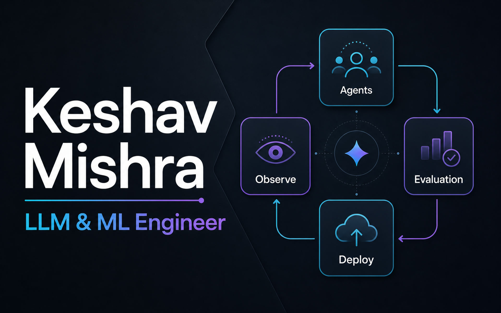

# Selene Yu - Portfolio

A modern, performant portfolio website built with Next.js 16, React 19, and TypeScript. Showcasing design engineering work, projects, and technical writing through a clean, accessible interface powered by the Once UI design system.



## About

This portfolio serves as a professional showcase for **Selene Yu**, a Design Engineer specializing in creating beautiful, functional user experiences. The site features:

- **Work Portfolio** - Featured projects and case studies
- **Technical Blog** - Articles on design engineering and development
- **About/CV** - Professional background and experience
- **Gallery** - Visual design work and explorations

**Live Site:** [Your deployment URL]

## Tech Stack

### Core Technologies
- **Next.js 16.1.6** - React framework with App Router
- **React 19.2.4** - UI library with latest features
- **TypeScript 5.9.3** - Type-safe development
- **Once UI 1.5.14** - Design system and component library

### Development Tools
- **Biome 2.3.13** - Fast linter and formatter
- **ESLint 9.39.2** - Code quality enforcement
- **Sass 1.97.3** - Advanced styling capabilities

### Content & Features
- **MDX** - Markdown with JSX for rich content
- **Next/OG** - Automatic Open Graph image generation
- **Schema.org** - Structured data for SEO
- **Responsive Design** - Optimized for all devices

## Getting Started

### Prerequisites

- **Node.js 20.9+** (required for Next.js 16)
- **npm** or **pnpm** package manager

### Installation

**1. Clone the repository**
```bash
git clone https://github.com/keshav1998/magic-portfolio.git
cd magic-portfolio
```

**2. Install dependencies**
```bash
npm install
```

**3. Run development server**
```bash
npm run dev
```

Open [http://localhost:3000](http://localhost:3000) to view the site.

**4. Build for production**
```bash
npm run build
npm start
```

## Configuration

### Design System

Edit the Once UI configuration to customize colors, typography, and design tokens:

```
src/resources/once-ui.config.ts
```

### Content

Update portfolio content, personal information, and site metadata:

```
src/resources/content.tsx
```

### Custom Styles

Add custom CSS for additional styling:

```
src/resources/custom.css
```

## Content Management

### Blog Posts

Create new blog posts by adding MDX files:

```
src/app/blog/posts/your-post-title.mdx
```

### Projects

Add project case studies:

```
src/app/work/projects/your-project.mdx
```

### MDX Features

- Full Markdown syntax support
- JSX components within content
- Code syntax highlighting
- Frontmatter metadata
- Automatic table of contents

## Development

### Available Scripts

```bash
npm run dev          # Start development server
npm run build        # Build for production
npm start            # Start production server
npm run lint         # Run ESLint
npm run biome-write  # Format code with Biome
```

### Code Quality

This project follows strict code quality standards:

- **TypeScript** for type safety
- **Biome** for fast, consistent formatting
- **ESLint** for code quality rules
- **Immutability patterns** throughout codebase
- **Component-driven architecture**

See [CONTRIBUTING.md](CONTRIBUTING.md) for detailed development guidelines.

## Project Structure

```
src/
├── app/                    # Next.js App Router
│   ├── api/               # API routes
│   ├── blog/              # Blog pages and posts
│   ├── work/              # Portfolio projects
│   ├── about/             # About/CV page
│   ├── gallery/           # Gallery page
│   └── layout.tsx         # Root layout
├── components/            # React components
│   ├── blog/             # Blog-specific components
│   ├── work/             # Portfolio components
│   └── ...               # Shared components
├── resources/            # Configuration and content
│   ├── content.tsx       # Site content
│   ├── once-ui.config.ts # Design system config
│   └── custom.css        # Custom styles
└── types/                # TypeScript type definitions

public/
├── images/               # Static images
│   ├── avatar.jpg       # Profile photo
│   └── og/              # Open Graph images
└── ...                  # Other static assets
```

## Deployment

### Vercel (Recommended)

This portfolio is optimized for deployment on Vercel:

1. Push your code to GitHub
2. Import project in Vercel dashboard
3. Vercel will auto-detect Next.js and configure build settings
4. Deploy with zero configuration

[](https://vercel.com/new/clone?repository-url=https%3A%2F%2Fgithub.com%2Fkeshav1998%2Fmagic-portfolio)

### Other Platforms

The site can be deployed to any platform supporting Next.js:

- **Netlify** - Configure build command: `npm run build`
- **Cloudflare Pages** - Supports Next.js with adapter
- **Self-hosted** - Use `npm run build && npm start`

See [Next.js deployment documentation](https://nextjs.org/docs/app/guides/deploying) for platform-specific guides.

## CI/CD

Automated workflows ensure code quality and deployment reliability:

- **Continuous Integration** - Automated testing and linting on every PR
- **Dependency Updates** - Automated security and version updates
- **Preview Deployments** - Every PR gets a preview URL
- **Production Deployment** - Automatic deployment on main branch merge

See [`.github/workflows/`](.github/workflows/) for pipeline configurations.

## Features

### SEO & Performance

- ✅ Automatic Open Graph image generation
- ✅ Schema.org structured data
- ✅ Optimized images with Next.js Image component
- ✅ Static generation for optimal performance
- ✅ Responsive design for all devices

### Content Features

- ✅ MDX-powered blog and projects
- ✅ Conditional section rendering
- ✅ Password-protected pages
- ✅ Automatic social link generation
- ✅ Dark/light mode support

### Developer Experience

- ✅ TypeScript for type safety
- ✅ Fast refresh during development
- ✅ Component-driven architecture
- ✅ Comprehensive linting and formatting
- ✅ Modern tooling (Biome, ESLint)

## Browser Support

- Chrome/Edge (latest 2 versions)
- Firefox (latest 2 versions)
- Safari (latest 2 versions)
- Mobile browsers (iOS Safari, Chrome Android)

## License

This project is based on [Magic Portfolio](https://github.com/once-ui-system/magic-portfolio) by Once UI.

**Original Template License:** CC BY-NC 4.0
- Attribution required
- Commercial usage not allowed without [Once UI Pro](https://once-ui.com/pricing) license

**This Portfolio:** Personal use for Selene Yu's professional portfolio.

## Acknowledgments

- **Once UI** - Design system and component library
- **Magic Portfolio** - Original template foundation
- **Next.js Team** - React framework
- **Vercel** - Hosting and deployment platform

## Contact

**Selene Yu** - Design Engineer

- Portfolio: [Your website URL]
- GitHub: [@keshav1998](https://github.com/keshav1998)
- [Other social links from your content.tsx]

---

Built with ❤️ using [Next.js](https://nextjs.org) and [Once UI](https://once-ui.com)
