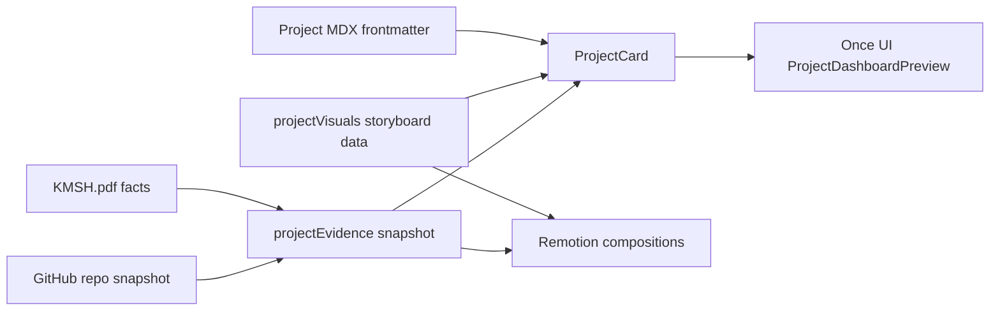

# feat: Add project evidence dashboards

## Summary

Transform each homepage project card from a static image/carousel surface into an
evaluator-first Once UI dashboard section backed by explicit receipts. The web sections and
Remotion project walkthroughs will share the same project facts so technical reviewers see the
same workflow, architecture, outcomes, and evidence in both surfaces.

---

## Problem Frame

The current project previews use generated/dashboard imagery and heuristic-looking metrics that
can read as decorative rather than credible. The portfolio needs to show real work signal: where
the project came from, what proof exists, which claims are sourced from GitHub or the resume, and
how confident a reviewer should be in each claim.

---

## Assumptions

*This plan was authored in LFG headless mode. The items below are agent inferences that fill
gaps in the input and should be reviewed during implementation and code review.*

- The primary audience is technical evaluators and recruiters.
- GitHub is the primary evidence source; `KMSH.pdf` is the fallback source for private or
  employer-bound projects.
- Project metrics must be receipts, not inferred scores. Gauges may visualize confidence,
  evidence coverage, or source completeness, but not fabricated performance.
- Once UI primitives and module SCSS are preferred over Tailwind utility classes because this
  repo's Once UI rules explicitly reject utility noise.
- Existing generated image assets in `public/images/projects/**` are user/worktree state and
  should not be reverted as part of this feature.

---

## Requirements

- R1. Each project card on the homepage presents as a project-specific dashboard section, not
  as a repeated generic image/card template.
- R2. Each surfaced metric or outcome has visible source context: source type, source label,
  confidence, and a link or resume reference when available.
- R3. GitHub-backed projects use repository data where available, including owner/repo, public
  URL, primary language, stars/forks when public, and last activity when accessible.
- R4. Resume-backed projects use `KMSH.pdf` facts for private, employer, or industrial work,
  without pretending those facts came from a public repository.
- R5. Web project sections preserve the requested hybrid hierarchy: one wide analytical panel,
  one gauge panel, then MasonryGrid/stacked supporting metric cards.
- R6. Motion stays breathable and reduced-motion-safe: Once UI effects and Framer Motion should
  animate opacity/transform only and respect `useReducedMotion` or Once UI reduced-motion props.
- R7. Remotion project walkthroughs mirror the web section content beats: evidence overview,
  workflow, architecture, and outcomes.
- R8. The implementation remains type-safe, JSON-serializable for Remotion `defaultProps`, and
  compatible with the existing Next.js App Router/Once UI codebase.

---

## Scope Boundaries

- Do not build live GitHub API fetching in the browser for this iteration; use a static,
  source-labeled project evidence snapshot generated from GitHub and `KMSH.pdf`.
- Do not introduce Tailwind classes, a new design system, or new dashboard dependencies.
- Do not import Remotion components into `src/app` or `src/components`.
- Do not rename project MDX files or route slugs.
- Do not commit rendered videos unless explicitly requested; validate Remotion code by version
  and bundle checks when Chromium render is blocked.

### Deferred to Follow-Up Work

- Automated evidence refresh pipeline: a future script can refresh the static snapshot from
  GitHub and resume sources.
- Full video render artifacts in `public/videos/project-walkthroughs/`: generate only when the
  user explicitly asks to commit rendered media.
- Dedicated visual regression test suite: useful later, but this repo currently has no browser
  test harness.

---

## Context & Research

### Relevant Code and Patterns

- `src/components/ProjectCard.tsx` already swaps carousel imagery for
  `ProjectDashboardPreview` when a `projectVisuals` entry exists.
- `src/components/project-dashboard/ProjectDashboardPreview.tsx` already implements the desired
  hybrid structure with `Card`, `Row`, `Column`, `MasonryGrid`, `LinearGauge`, `RadialGauge`,
  `TiltFx`, `HoloFx`, `MatrixFx`, and Framer Motion variants.
- `src/components/gitaura/GitAuraDashboardHero.tsx` is the strongest local precedent for a
  Once UI dashboard surface with bento metrics, book/widget styling, gauges, and motion.
- `src/resources/projectVisuals.ts` is already shared by web previews and Remotion compositions,
  and the local resource rules require it to stay JSON-serializable.
- `remotion/Root.tsx`, `remotion/ProjectWalkthrough.tsx`, and
  `remotion/ProjectDashboardWalkthrough.tsx` already register one composition per project and
  consume `projectVisuals` through Remotion `defaultProps`.
- `src/app/work/projects/*.mdx` contains case-study copy and several public GitHub/package links.
- `KMSH.pdf` contains resume facts such as 6 months to 2 weeks for agent development, 119 to
  1,900 active users for Trader, 0 to 170 users in 2 weeks for agents-fun-eliza, 500+ hours per
  month saved at Mechademy, 20% repair-time reduction, and up to 96.5% failure-prediction
  accuracy.

### Institutional Learnings

- No `docs/solutions/` directory exists in this repo, so there are no local solution learnings
  to apply.

### External References

- Once UI Context7 synthesis: use semantic `Row`, `Column`, `Grid`, and `Card` primitives;
  responsive breakpoints belong in component props; asymmetric/bento layouts can use flex and
  grid structure; dashboard metrics should use Once UI gauges and effects rather than custom
  styling.
- Remotion Context7 synthesis: data-driven videos should use `Composition` `defaultProps`,
  `Sequence`, `AbsoluteFill`, `interpolate`, `Easing`, `useCurrentFrame`, `useVideoConfig`, and
  `staticFile` for public assets. Multiple compositions from shared data are a supported pattern.
- Framer Motion Context7 synthesis: use `motion` wrappers, variants, staggered reveal, and
  transform/opacity interactions; reduced-motion behavior must be preserved when combining with
  component libraries.
- GitHub snapshot: `gh` is authenticated as `kmshdev`; the user profile reports 59 public repos,
  22 followers, and current public project data is accessible for at least `kmshdev/*`,
  `valory-xyz/agents-fun-eliza`, `valory-xyz/trader`, `valory-xyz/plugin-memeooorr`, and
  `kmshdev/claude-swift-toolkit`.

---

## Key Technical Decisions

- Separate evidence from storyboard copy: create a typed project evidence snapshot rather than
  burying source metadata inside MDX prose or Remotion-only scene data.
- Keep `projectVisuals` as the shared storyboard surface and join it with evidence by slug so
  Remotion remains prop-driven and JSON-serializable.
- Replace heuristic dashboard scores with source-backed confidence and evidence coverage gauges.
- Preserve the hybrid bento/MasonryGrid hierarchy in the card preview while making supporting
  cards specific to each project's receipts.
- Keep Remotion visually parallel to the web dashboard, but implement it with Remotion timing
  primitives instead of web motion/effect components.

---

## Open Questions

### Resolved During Planning

- Should implementation keep asking for scope details? No. The user explicitly asked for LFG
  execution over the already-defined goal.
- Should GitHub or resume be authoritative? GitHub is primary; `KMSH.pdf` is fallback.
- Should metrics be inferred from list lengths? No. Existing heuristic scoring must be replaced
  with receipt-backed signals.

### Deferred to Implementation

- Exact evidence values for repos that fail `gh repo view`: implementation should mark those
  receipts as unavailable or resume-backed rather than inventing values.
- Exact visual copy density per project: implementation should tune labels to fit the existing
  Once UI card sizes and verify in browser.

---

## Output Structure

```text
src/resources/
  projectEvidence.ts
src/components/project-dashboard/
  ProjectDashboardPreview.tsx
remotion/
  ProjectDashboardWalkthrough.tsx
docs/plans/
  2026-05-05-001-feat-project-evidence-dashboards-plan.md
```

---

## High-Level Technical Design

> *This illustrates the intended approach and is directional guidance for review, not
> implementation specification. The implementing agent should treat it as context, not code to
> reproduce.*



---

## Implementation Units

- U1. **Create sourced project evidence snapshot**

**Goal:** Add a typed data module that maps each project slug to source-labeled receipts,
confidence, links, and project-specific evidence metrics.

**Requirements:** R2, R3, R4, R8

**Dependencies:** None

**Files:**
- Create: `src/resources/projectEvidence.ts`
- Modify: `src/resources/index.ts`
- Test: no dedicated test file because the repo has no test runner; type-checking and linting
  are the verification surface.

**Approach:**
- Model evidence as serializable data: source type, label, href/reference, confidence,
  metric/value pairs, and short proof notes.
- Fill public repo-backed items from GitHub where accessible.
- Fill private/employer projects from `KMSH.pdf` with clear `resume` source labels.
- Avoid numeric claims unless they are present in GitHub, MDX, or the resume.

**Patterns to follow:**
- `src/resources/projectVisuals.ts` for JSON-serializable resource data.
- `src/resources/githubAura.ts` for static, source-labeled snapshot style.

**Test scenarios:**
- Happy path: every `projectVisuals` slug has a corresponding evidence entry or a deliberate
  fallback entry.
- Edge case: a project with no public repository still renders source context from the resume
  instead of blank or fabricated GitHub fields.
- Error path: a missing receipt URL does not break dashboard rendering because the source label
  remains visible.

**Verification:**
- Type checking proves the evidence entries satisfy the exported types.
- Linting reports no warnings.

- U2. **Replace generic project dashboard metrics with evidence receipts**

**Goal:** Update the web dashboard preview so each project card shows a wide analytical panel,
one gauge panel, and MasonryGrid supporting cards based on evidence rather than synthetic
scores.

**Requirements:** R1, R2, R5, R6, R8

**Dependencies:** U1

**Files:**
- Modify: `src/components/project-dashboard/ProjectDashboardPreview.tsx`
- Modify: `src/components/ProjectCard.tsx`
- Test: no dedicated test file because the repo has no test runner; browser inspection plus
  type-check/lint/build are required.

**Approach:**
- Join `ProjectVisual` and project evidence by slug in `ProjectCard`.
- Use the wide panel for project summary plus top receipts.
- Use `RadialGauge` for evidence confidence/coverage, not arbitrary project quality.
- Use `MasonryGrid` for workflow, architecture, outcomes, and receipts/proof cards.
- Keep Framer Motion variants limited to opacity/transform and respect reduced motion.

**Patterns to follow:**
- `src/components/project-dashboard/ProjectDashboardPreview.tsx` existing hybrid layout.
- `src/components/gitaura/GitAuraDashboardHero.tsx` for Once UI effect composition and gauge
  presentation.

**Test scenarios:**
- Happy path: a GitHub-backed project shows repo source, language/activity counts, workflow,
  architecture, and sourced outcomes.
- Happy path: a resume-backed project shows resume source, confidence, workflow, architecture,
  and sourced outcomes without broken links.
- Edge case: long project titles and long source labels wrap without overlapping at desktop and
  mobile widths.
- Error path: missing optional source href renders as non-clickable source text without a runtime
  error.
- Integration: `Projects` renders all project cards using the new dashboard without changing
  slug sorting or links.

**Verification:**
- Homepage renders without console errors.
- The dashboard no longer displays heuristic workflow/architecture/outcome percentages derived
  from list length.

- U3. **Align Remotion dashboard walkthroughs with evidence data**

**Goal:** Update Remotion project dashboard walkthroughs so their beats mirror the web dashboard:
evidence overview, workflow, architecture, and outcomes.

**Requirements:** R2, R7, R8

**Dependencies:** U1

**Files:**
- Modify: `remotion/ProjectDashboardWalkthrough.tsx`
- Modify: `remotion/Root.tsx`
- Test: no dedicated test file because Remotion verification is command-based in this repo.

**Approach:**
- Pass evidence into dashboard compositions through serializable `defaultProps`.
- Replace synthetic KPI cards with source-backed evidence cards.
- Keep Remotion animation on `useCurrentFrame`, `useVideoConfig`, `Sequence`, `AbsoluteFill`,
  `interpolate`, and `Easing`.
- Use `staticFile` for public images and preserve stable composition IDs.

**Patterns to follow:**
- `remotion/ProjectWalkthrough.tsx` for scene timing and architecture/workflow beats.
- `remotion/AGENTS.md` conventions for composition IDs, FPS, dimensions, and verification caveats.

**Test scenarios:**
- Happy path: every project dashboard composition receives a project and evidence object.
- Edge case: projects with fewer receipts still fill the scene without empty KPI boxes.
- Error path: missing optional repo link does not produce invalid Remotion props.
- Integration: the Remotion root registers project dashboard compositions for all entries.

**Verification:**
- `npx remotion versions` shows aligned Remotion packages.
- Remotion bundle succeeds. Browser-backed still/render may remain blocked by macOS sandbox.

- U4. **Verify layout quality and clean the plan-scoped diff**

**Goal:** Validate type safety, lint cleanliness, browser layout, and Remotion bundle health,
then make only plan-scoped cleanup.

**Requirements:** R1, R5, R6, R7, R8

**Dependencies:** U2, U3

**Files:**
- Modify: plan-scoped files only if verification exposes issues.
- Test: no dedicated test file; verification uses the repo scripts and browser inspection.

**Approach:**
- Run the repo's type-check, lint, and build path.
- Start the Next.js dev server and inspect `http://localhost:3002` or the next available port.
- Check desktop and mobile widths for overlapping text, abnormal spacing, and repeated template
  feel.
- Validate Remotion package alignment and bundle.

**Patterns to follow:**
- `package.json` scripts.
- `remotion/AGENTS.md` sandbox caveat for still/render claims.

**Test scenarios:**
- Integration: homepage shows all project sections with distinct evidence and no repeated
  synthetic score dashboard.
- Edge case: mobile viewport stacks the wide analytical panel, gauge panel, and MasonryGrid
  without horizontal overflow.
- Error path: if Chromium render fails, final notes state the sandbox limitation and do not
  claim rendered video verification.

**Verification:**
- Type-check, lint, build, browser inspection, and Remotion version/bundle checks have current
  results in the final handoff.

---

## System-Wide Impact

- **Interaction graph:** `Projects` -> `ProjectCard` -> `ProjectDashboardPreview` expands to
  include evidence data; Remotion root expands `defaultProps` to include matching evidence.
- **Error propagation:** Missing optional source data should degrade to visible source labels,
  not runtime failure.
- **State lifecycle risks:** Static evidence can become stale; snapshot labels and confidence
  make this visible.
- **API surface parity:** Web and Remotion consume the same project/evidence data contract.
- **Integration coverage:** Browser inspection is required because this is a layout-heavy
  feature without an existing test harness.
- **Unchanged invariants:** MDX slugs, routes, project sorting, and stable Remotion composition
  IDs remain unchanged.

---

## Risks & Dependencies

| Risk | Mitigation |
|------|------------|
| Evidence becomes stale | Include source labels/snapshot framing and keep refresh automation deferred. |
| Resume-backed claims look weaker than GitHub-backed claims | Show source type and confidence instead of hiding the distinction. |
| Once UI layout becomes cluttered | Preserve the hybrid hierarchy and use MasonryGrid only for supporting cards. |
| Remotion render blocked by sandbox | Use version and bundle verification, and avoid claiming visual render proof when Chromium fails. |
| Existing dirty worktree contains unrelated generated assets | Stage/edit only plan-scoped files and do not revert existing user changes. |

---

## Documentation / Operational Notes

- The final implementation handoff should mention which claims are GitHub-backed versus
  resume-backed.
- If rendered videos are later requested, use `public/videos/project-walkthroughs/` and keep
  large media commits explicit.

---

## Success Metrics

- All project previews on the homepage use evidence-backed dashboards.
- No project dashboard shows list-length-derived quality percentages.
- Every visible claim has a source label and confidence context.
- Web and Remotion project dashboard content stay aligned through shared data.
- Type-check, lint, build, browser inspection, and Remotion verification complete or report a
  concrete blocker.

---

## Sources & References

- Related code: `src/components/ProjectCard.tsx`
- Related code: `src/components/project-dashboard/ProjectDashboardPreview.tsx`
- Related code: `src/components/gitaura/GitAuraDashboardHero.tsx`
- Related data: `src/resources/projectVisuals.ts`
- Related data: `src/resources/githubAura.ts`
- Related Remotion: `remotion/Root.tsx`
- Related Remotion: `remotion/ProjectWalkthrough.tsx`
- Related Remotion: `remotion/ProjectDashboardWalkthrough.tsx`
- Related content: `src/app/work/projects/*.mdx`
- Resume source: `KMSH.pdf`
- External docs: Context7 Once UI `/once-ui-system/core`
- External docs: Context7 Remotion `/remotion-dev/remotion`
- External docs: Context7 Framer Motion `/grx7/framer-motion`
